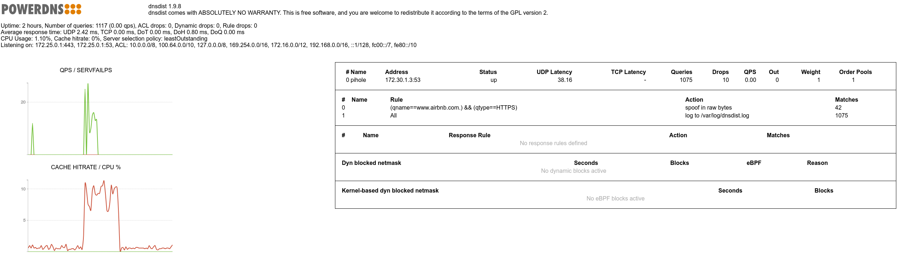

# ApexDNS
This repo is for hacking your local DNS to make encrypted web browsing blazingly fast.

<p align="center">
  
</p>

## Problem of today's Internet
While the fastest encrypted protocol, QUIC, is getting ubiquitous, fully benefitting from it requires a lot of extra steps that might defeat its whole purpose, especially the fast initial connections.

In a nutshell, connecting to a QUIC enabled website, there are a lot of things going on underneath. For instance, you open your browser and navigate to `amazon.com`. 
Let me tell you briefly what happens underneath --- and I am not going to discuss the browser's background traffic (e.g., OCSP, firefox services, tracking protection, safebrowsing), but I assume you also use DNS-over-HTTPS for increased privacy (which is btw. enabled by default in many browsers including Firefox)

1. DNS query to `amazon.com HTTPS` record
2. DNS response `HTTPS` record for `amazon.com` (usually `SOA`, i.e., "no data")
3. DNS query to `amazon.com A` record
4. DNS response `A` record for `amazon.com`
5. TCP handshake to `amazon.com` (on port `80`)
6. HTTP `GET`
7. HTTP `301 - Moved permanently to https://amazon.com`
8. DNS query to `amazon.com A` record
9. DNS response `A` record for `amazon.com`
10. TCP handshake to `amazon.com` (on port `443`)
11. TLS handshake to `amazon.com` (on port `443`)
12. HTTP `GET`
13. HTTP '301 - Moved permanently to http://www.amazon.com`
14. DNS query to `www.amazon.com HTTPS` record
15. DNS response `HTTPS` record for `www.amazon.com` (usually `SOA`, i.e., "no data")
16. DNS query to `www.amazon.com A` record
17. DNS response `A` record for `www.amazon.com`
18. TCP handshake to `www.amazon.com` (on port `80`)
19. HTTP `GET`
20. HTTP `301 - Moved permanently to https://www.amazon.com`
21. DNS query to `www.amazon.com A` record
22. DNS response `A` record for `www.amazon.com`
23. TCP handshake to `amazon.com` (on port `443`)
24. TLS handshake to `amazon.com` (on port `443`)
25. HTTP `GET`
26. HTTP `200 - OK` + `HEADERS: alt-svc: "h3"` <-- indicator or QUIC option
27. QUIC Initial (TLS handshake) to `www.amazon.com`

One can observe that due to the fallback mechanisms/backward compatiblity, it takes a lot of time and packets to connect to a website through QUIC.

## (Partial) Solution
`HTTPS` record in the DNS has many purposes and we can see that the browser is asking for those records when trying to visit a domain. In fact, those records are queried even before the `A` records. 
While `HTTPS` record was recently more connected to the fact of using ECH and distribute the encryption keys, it also became merged with SVCB record types. What does this mean? It means that any alternative servicing information can be imprinted into the HTTPS records. And guess what, you can add QUIC support in HTTPS record...sounds cool right? Considering the above list, if we can get the QUIC-related information straight away among the first DNS queries, we can indeed make our connections fast, don't we?
Cloudflare knows this and since it supports QUIC, it also adds the appropriate HTTPS records automatically to all of its customers. So if your content is fully hosted by cloudflare, you are providing it in the fastest and most secure way. However, it is not the case Internet-wise.
Among the first 5000 domains (from Tranco's list), really only those have relevant HTTPS records that are served by cloudflare, the rest either completely neglect or provide not too much details in this regard.

## ApexDNS
ApexDNS is a `dnsdist` proxy that provides a PoC (Proof-of-Concept) implementation of tampering the DNS responses and adding the relevant HTTPS records for websites. Therefore, we can hack our Internet browsing to be the fastest yet the safest possible, without waiting for all content providers to slowly implement this...if it ever comes in the near future.

# Install
## Requirements
### dnsdist 1.9 and above
We need dnsdist v1.9 or above that supports spoofing of any raw response.
To install it on Debian 12, do the following.

Update application list:
```
$ sudo echo "deb [signed-by=/etc/apt/keyrings/dnsdist-19-pub.asc] http://repo.powerdns.com/debian bookworm-dnsdist-19 main" | sudo tee /etc/apt/sources.list.d/pdns.list
```
Update priority to install dnsdist from the newly added repo
```
$ sudo echo "Package: dnsdist*"| sudo tee /etc/apt/preferences.d/dnsdist-19  
$ sudo echo "Pin: origin repo.powerdns.com" |sudo tee -a /etc/apt/preferences.d/dnsdist-19  
$ sudo echo "Pin-Priority: 600" |sudo tee -a /etc/apt/preferences.d/dnsdist-19  
```
Update and install
```
$ sudo install -d /etc/apt/keyrings; curl https://repo.powerdns.com/FD380FBB-pub.asc | sudo tee /etc/apt/keyrings/dnsdist-19-pub.asc
$ sudo apt-get update
$ sudo apt-get install dnsdist
```

For more installation instructions, check out [repo.powerdns.om](https://repo.powerdns.com/).


### pdnutils
We need to install the main powerdns server package for a binary we will be using.
```
$ sudo apt-get install pdns-server
```


# Disable dnsdist.service and pdns.service
To avoid screwing up our whole system in the beginning, switch off `dnsdist` proxy and `pdns` authoritative server to run as an always-on service
```
$ sudo systemctl stop dnsdist.service
$ sudo systemctl disable dnsdist.service
$ sudo systemctl stop pdns.service
$ sudo systemctl disable pdns.service
```
 
# Checkout repo
```
$ git clone https://github.com/cslev/ApexDNS
$ cd ApexDNS
```

# Configure
Edit the `dnsdist.conf`. Correct the path to the HTTPS certificates as they are needed for DNS-over-HTTPS interface.
Read the comments in the config file to know how to generate and manipulate the DNS responses.

For instance, to get create a RawSpoof response of 
`'HTTPS '1 . alpn="h3,h2" ipv4hint=23.48.224.103'`, we need to do:
```
$ sudo pdnsutil raw-lua-from-content HTTPS '1 . alpn="h3,h2" ipv4hint=23.48.224.103'
"\000\001\000\000\001\000\006\002h\051\002h\050\000\004\000\004\023\048\224g"
``` 
Then, use the produced output as a raw response.


# Run
Once configured, just run it with the config file set.
```
$ sudo dnsdist -C dnsdist/dnsdist.conf
```

# Monitoring
There is a web interface for dnsdist running by default at `http://127.0.0.1:8083/`. Here, you can observe your modified responses and whether there was any hit for that query. Besides, performance metrics are visible too.


Alternatively, can view `/var/log/dnsdist.log`.

# NANOG 95 Presentation
Presentation slides are available in `assets/slides/`.


